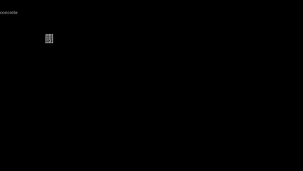
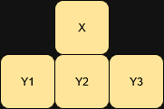

# P1 - Cellular Automata

## Description

This project is inspired by the game Noita and features a cellular automata with 4 different matters that can interact with each other. I particularly like the idea that some simple rules create complex and interesting situations and in my opinion it is one the best demonstractions of emergent behavior.

## Implementation Details

The biggest problem implementing this was to make sure that all of the Cells are updated in the right order. The problem can be described as follows:

We have a Cell X and a 3 Cells Y. Lets assume for simplicity that they are all the same type - Grain Cell. All cells are falling down. If we process Cell X earlier than any of the Cell Y, then according to the rule of Grain Cell - it will stop and not mark itself as the one, pending for update. This way it will just be floating in the air.

In order to adress this issue Cells that we need to process int the next frame are put into the queue. Those Cells that spawned earlier will be processed in the first place. So if we have Grain Cells that are falling - it's natural that the ones that are lower will be processed sooner. However, another issue is that due to chaotic nature of simulation it's very likely that we might mark the same Cell for update in one frame. In order to avoid it the set have been used. Thus, the utility class Unique Queue helps to solve both problems simultaniously.

## Future improvements

1. Support multithreading - the grid can be split into a number of blocks. Each block can be processed in it's own thread. Will allow bigger number of cells on screen.
2. Add more traits for cells. Flamability, hardness, wetness - these euristic parameters much like density will help to further deepen the behavior of the simulation.
3. Add more cell types - simply for diversity.